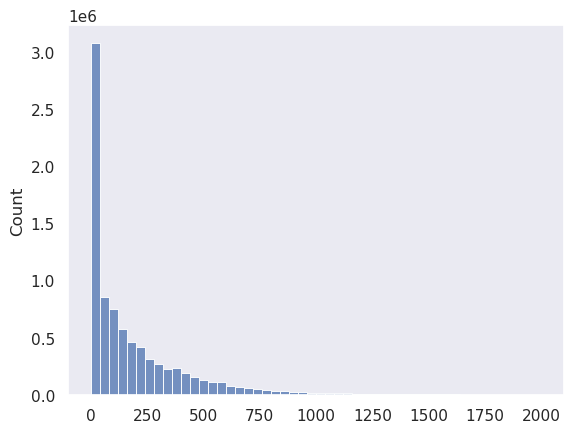
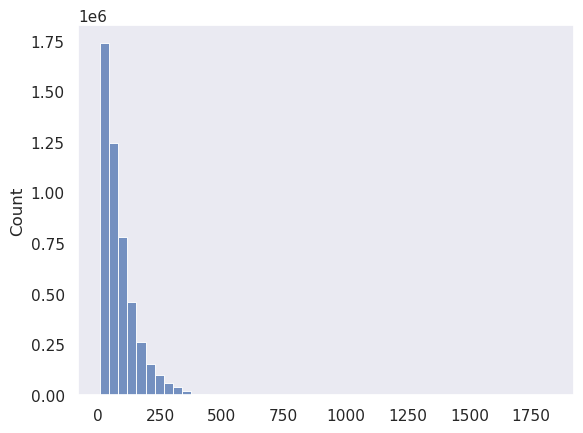
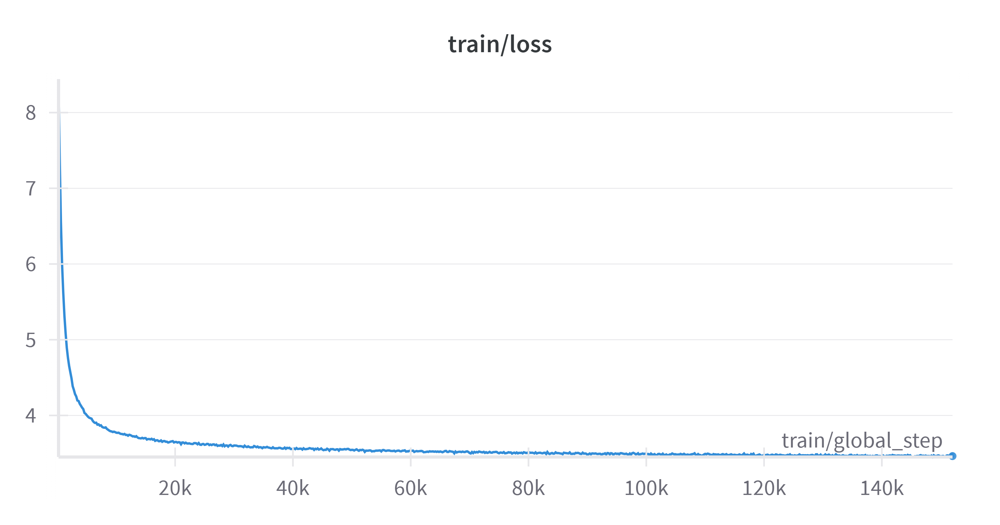
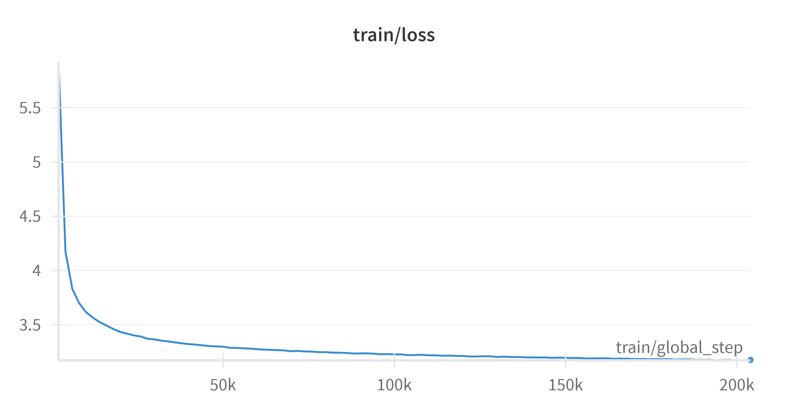
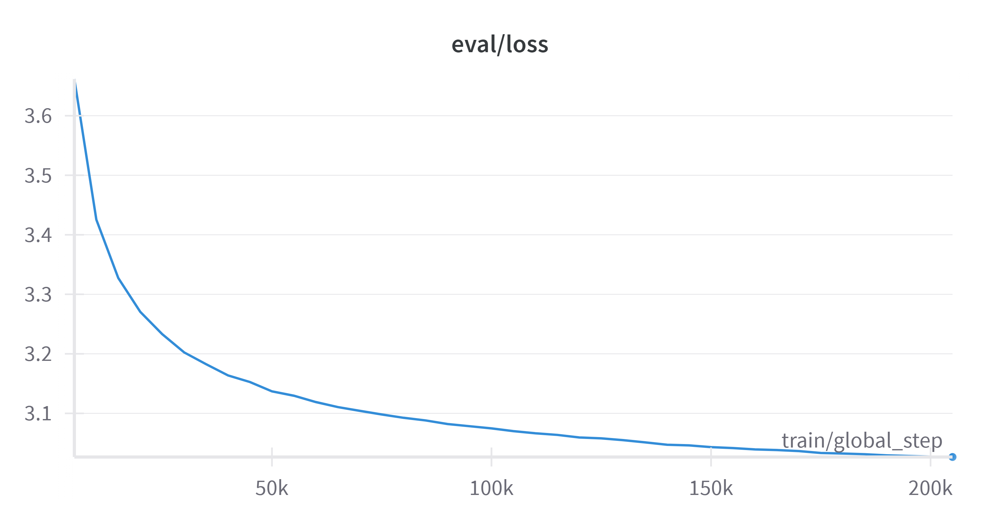

<p align="center">
  
</p>
<!--  -->

# arabic-nano-gpt

Arabic Nano GPT Trained on Arabic Wikipedia Dataset from Wikimedia. This code is for education and demonstration purposes to experience the entire workflow of LLMs **pre-training** on the Nano Scale. This code is designed to load a dataset, preprocess its text, train a tokenizer on it, and lastly train a model using _Causal Language Modeling_.

_Link to models collection on HuggingFace_ -- [Arabic Nano GPT Models](https://huggingface.co/collections/e-hossam96/arabic-nano-gpt-models-67205cb4ddbde77be9c7b532)

## Setup

This environment is setup to work on a Linux platform. Make sure to use WSL2 on windows.

- Clone this repository.

```bash
git clone https://github.com/e-hossam96/arabic-nano-gpt.git
```

- Install developer tools for C++ package building. _used for torch compile_

```bash
sudo apt update
sudo apt upgrade -y
sudo apt install build-essential
```

- Download and install Miniconda

```bash
wget https://repo.anaconda.com/miniconda/Miniconda3-latest-Linux-x86_64.sh
bash Miniconda3-latest-Linux-x86_64.sh -b -p ./miniconda
```

- Activate conda `base` environment.

```bash
source ./miniconda/bin/activate
```

- Create **nanogpt** env from [YAML](./environment.yml) file

```bash
cd arabic-nano-gpt
conda env create -f environment.yml
conda activate nanogpt
```

- Fill [example.env](./example.env) file and save it into a `.env` file.

```bash
cp example.env .env
```

## Execution

The _bash_ script code in [train_ml.sh](./train_lm.sh) is used to define the configurations to run all the Python scripts in the `src` folder. All you need to do is to define your configurations based on your needs and run the bash script and it handle every thing as follows.

- Decide on the _raw_ data and where its preprocessed version will be saved.

```bash
DATA_CKPT=wikimedia/wikipedia
SUB_DATA=20231101.ar
PROCESSED_DATA_PATH=data/$DATA_CKPT.csv
```

- Define the tokenizer configurations. The default is a `GPT2` based tokenizer trained from scratch on the data. After training, the tokenizer will be saved in the same directory as your intended model.

```bash
BASE_MODEL=openai-community/gpt2
MODEL_NAME=arabic-nano-gpt-v2
MODEL_PATH=models/$MODEL_NAME
MODEL_MAX_LENGTH=1024
VOCAB_SIZE=16384
```

- Define the end model configurations. The more the parameters, the larger the model and the longer it needs to train on the data.

```bash
EMBED_SIZE=384
NUM_ATT_HEAD=6
NUM_ATT_LAYERS=8
```

- Define the training parameters. Make sure to choose reasonable values. The default is to train the model on the entire data but this will take so long. You can define another parameter called `SPLIT_SIZE` and use it as input to the [train_causeal_lm.py](./src/train_causal_lm.py) to select a small sample of the data.

```bash
NUM_EPOCHS=8
BATCH_SIZE=32
ACCUM_STEPS=8
EVAL_STEPS=5000
LOG_STEPS=2000
LR=0.0001
WD=0.000001
WARMUP=0.01
```

- Run the script inside the activated `nanogpt` conda environment and wait tell the results are logged on your **Weights & Biased** account.

```bash
bash train_lm.sh
```

## Small Batch Overfitting

Before training your model for a long time and not being sure about its final state, you should experiment with a small batch using the `SPLIT_SIZE` parameter and try to bring the training loss to near zero. In the three checkpoints we have produced, we ensured that the architecture and the training step will actually bring the loss to near zero. W&B runs will be shared later to check the values.

To do so, you need to define a reasonable learning rate (`LR`) for the small batch (`SPLIT_SIZE`) and train for longer using the `NUM_EPOCHS`. You should also comment the **early stopping** `callback` from the HuggingFace's `Trainer` in this step in [train_causeal_lm.py](./src/train_causal_lm.py).

```python
trainer = Trainer(
    model=model,
    args=training_args,
    train_dataset=tokenized_dataset["train"],
    eval_dataset=tokenized_dataset["valid"],
    data_collator=data_collator,
    tokenizer=tokenizer,
    # callbacks=[EarlyStoppingCallback(early_stopping_patience=5)],
)
```

Once validated, you can remove the `SPLIT_SIZE` parameter, re-define the training configurations to match the full data training, and run the codes safely.

## Data Pre-processing

For this step, we followed simple steps to preprocess and clean the text. The dataset is already almost clean but we needed to further preprocess it before training. We extracted all the paragraphs by splitting on the `\n\n` characters after each paragraph in an article. Also, we removed all the diacritics using the `strip_tashkeel` function from `PyAraby` and padded all the punctuations using white spaces as per the **AraGPT2** paper. This left us with around **8.5 Million** paragraphs with the following length distribution.



We further removed all the sentences that are less than _60_ and more than _1250_ characters to have consistent-length paragraphs (docs from now on). This left us with around **4.8 Million** docs of high quality of meaning (at least!).

The resulting docs are saved into a _CSV_ file to avoid extra-splitting on new line characters when saved into a text file.

## Tokenization

We didn't do much to train the tokenizer. We just used the `train_from_iterator` method from the _GPT2 pretrained tokenizer_ and passed it a generator (defined below) of all the docs to train.

```python
  def get_dataset_iterator(data, batch_size: int = 1024):
      for i in range(0, len(data), batch_size):
          yield data[i : i + batch_size]["text"]
```

The tokenizer produced number of tokens distribution for all the high quality docs that is consistent with the length distribution from above.



We then saved the tokenizer to the same directory of the model (to be trained in the following step).

## GPT2-Based Models

We have trained three different model sizes that have different number of attention heads and layers and have different embedding dimention. The context length (also the number of positions) is left to be _1024_ which the default for the **GPT2** model. The models number of parameters and memory footprint is provided in the following table.

|     Model Name     | Parameters |  Size   |
| :----------------: | :--------: | :-----: |
| arabic-nano-gpt-v0 |   5.5 M    | 26.3 MB |
| arabic-nano-gpt-v1 |   10.6 M   | 46.7 MB |
| arabic-nano-gpt-v2 |   20.9 M   | 91.9 MB |

The following table compares all the training and architecture configurations used for the three models.

| Parameter \ Molel Name | arabic-nano-gpt-v0 | arabic-nano-gpt-v1 | arabic-nano-gpt-v2 |
| :--------------------: | :----------------: | :----------------: | :----------------: |
|      Dataset Size      |       4.86M        |       4.86M        |       4.86M        |
|       Vocab Size       |        8192        |        8192        |       16384        |
|     Context Length     |        1024        |        1024        |        1024        |
|     Embedding Size     |        256         |        384         |        384         |
|    Attention Layers    |         4          |         4          |         8          |
|    Attention Heads     |         4          |         4          |         6          |
|       Num Epochs       |         24         |         24         |         8          |
|     Early Stopping     |        True        |        True        |        True        |
|     Training Steps     |        150K        |        200K        |        130K        |
|       Batch Size       |        256         |        512         |        256         |
|     Learning Rate      |       0.001        |       0.0002       |       0.0001       |
|      Weight Decay      |      0.00001       |      0.00001       |      0.000001      |
|      Warmup Ratio      |        0.01        |        0.01        |        0.01        |

## Performance Comparison

The held-out test set loss values are reported for the three checkpoints in the following table as a quntative measure.

|     Model Name     | Test Loss |
| :----------------: | :-------: |
| arabic-nano-gpt-v0 |   3.288   |
| arabic-nano-gpt-v1 |   3.029   |
| arabic-nano-gpt-v2 |    --     |

For a qualitative measure, the three models were tested against the following prompt to complete. The generation parameters were cherry picked to provide decent generations. Also, the training logs and the generations for each model model is presented under the respective model sections.

```python
prompt = """المحرك النفاث هو محرك ينفث الموائع (الماء أو الهواء) بسرعة فائقة \
لينتج قوة دافعة اعتمادا على مبدأ قانون نيوتن الثالث للحركة. \
هذا التعريف الواسع للمحركات النفاثة يتضمن أيضا"""
```

### V0

#### Generations

""

#### Logs




### V1

#### Generations

""

#### Logs




### V2

## Conclusions

## Credits

- [Andrej Karpath - Let's build GPT: from scratch, in code, spelled out.](https://youtu.be/kCc8FmEb1nY?si=8JT3htJzRgmVOwZQ)
- [Andrej Karpath - nanoGPT](https://github.com/karpathy/nanoGPT)
- [Pretraining a 124-M Parameter GPT-2 Language Model](https://wandb.ai/bkkaggle/lm-finetuning/reports/Pretraining-a-124-M-Parameter-GPT-2-Language-Model--VmlldzoyMjg4NzA)
- [AraGPT2: Pre-Trained Transformer for Arabic Language Generation](https://aclanthology.org/2021.wanlp-1.21/)

## License

MIT
